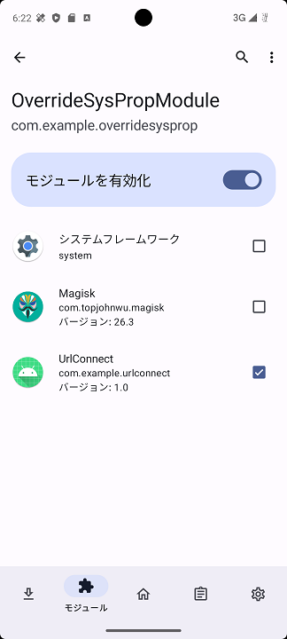

Android 14 の Root証明書インストールバイパス
=============

Language/[English](Readme.md)

## 概要

Android 14 以降では信頼されたRoot証明書へのインストールが困難になっている｡

- https://httptoolkit.com/blog/android-14-breaks-system-certificate-installation/

本制限をバイパスするための方法を示す。

## バイパスポイント

API-34 よりシステムの証明書を読み込む処理にて、「/apex/com.android.conscrypt/cacerts」より証明書読み込むようになっているが
システムプロパティが「system.certs.enabled」となっている場合は、以前の「/system/etc/security/cacerts/」より証明書を取得するコードになっている。

- https://android-review.googlesource.com/c/platform/prebuilts/fullsdk/sources/+/2704396/1/android-34/android/security/net/config/SystemCertificateSource.java

````java
private static File getDirectory() {
    if ((System.getProperty("system.certs.enabled") != null)
            && (System.getProperty("system.certs.enabled")).equals("true")) {
        return new File(System.getenv("ANDROID_ROOT") + "/etc/security/cacerts");
    }
    File updatable_dir = new File("/apex/com.android.conscrypt/cacerts");
    if (updatable_dir.exists()
            && !(updatable_dir.list().length == 0)) {
        return updatable_dir;
    }
    return new File(System.getenv("ANDROID_ROOT") + "/etc/security/cacerts");
}
````

バイパスを行うためにこの仕様を利用します。

## concrete procedure

「system.certs.enabled」のシステムプロパティを書き換える方法として、Android の XposedModule を作成しました。

「OverrideSysPropModule/app/release」フォルダに作成した XposedModule のアプリを置いています。

## 手順 (Emulator)

### Magisk をインストール

エミュレータの場合、以下の手順で Magisk をインストールする。

1. https://github.com/newbit1/rootAVD より git cloneを行う

```
git clone https://github.com/newbit1/rootAVD.git
```
2. エミュレータを起動する。
3. 管理画面の PowerShell から以下のコマンドを実行しインストールするADVを確認する。

```sh
.\rootAVD.bat ListAllAVDs

...

Command Examples:
rootAVD.bat
rootAVD.bat ListAllAVDs
rootAVD.bat InstallApps

rootAVD.bat system-images\android-34\google_apis_playstore\x86_64\ramdisk.img
rootAVD.bat system-images\android-34\google_apis_playstore\x86_64\ramdisk.img FAKEBOOTIMG
rootAVD.bat system-images\android-34\google_apis_playstore\x86_64\ramdisk.img DEBUG PATCHFSTAB GetUSBHPmodZ
rootAVD.bat system-images\android-34\google_apis_playstore\x86_64\ramdisk.img restore
rootAVD.bat system-images\android-34\google_apis_playstore\x86_64\ramdisk.img InstallKernelModules
rootAVD.bat system-images\android-34\google_apis_playstore\x86_64\ramdisk.img InstallPrebuiltKernelModules
rootAVD.bat system-images\android-34\google_apis_playstore\x86_64\ramdisk.img InstallPrebuiltKernelModules GetUSBHPmodZ PATCHFSTAB DEBUG
```

4. 最新の Magsisk をダウンロード

- https://github.com/topjohnwu/Magisk/releases

5. 「rootAVD/Apps」のフォルダにダウンロードしたMagiskアプリをコピーする。
6. 最新の Magisk を含めてインストール

```sh
.\rootAVD.bat system-images\android-34\google_apis_playstore\x86_64\ramdisk.img
```

### Magisk Module をインストール

1. Magisk Module をインストールする。

- https://github.com/NVISOsecurity/MagiskTrustUserCerts/releases
- https://github.com/LSPosed/LSPosed/releases (zygisk 版をインストール)

必要に応じてインストール

- https://github.com/LSPosed/LSPosed.github.io/releases

### XposedModule Module をインストール

1. 「OverrideSysPropModule」フォルダ内の XposedModule をインストール。

````
cd OverrideSysPropModule\app\release
adb install app-release.apk
````

2. ユーザ証明書にBurpなどのRoot証明書をインストールする。

3. Moduleを適用したいアプリに対して有効にする。



TIP:  XposedModule有効後、Android端末を再起動しないとうまく認識しない場合がある。